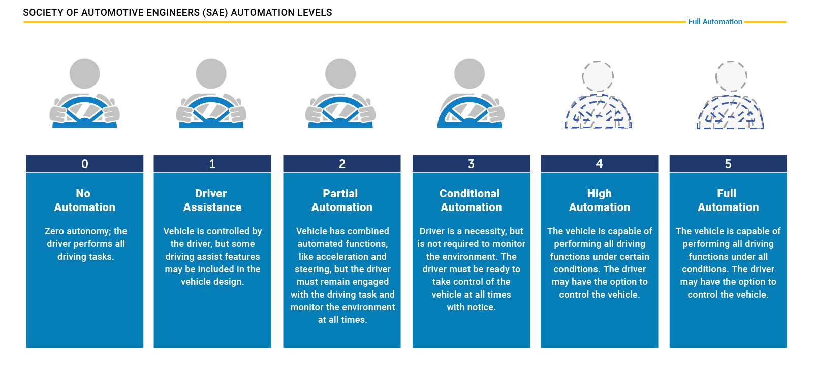

# LiDAR sensor

## General role of LiDAR in autonomous driving
### Levels of autonomous driving

[source](https://www.nhtsa.gov/vehicle-safety/automated-vehicles-safety)

- For many years, driver assistance systems (ADAS) such as forward collision warning and braking or adaptive cruise control were the only systems available that at least automated a single vehicle function in some driving situations (either safety or comfort).
-  Tesla has been one of the first companies world-wide to introduce a system into the market that implied a high degree of autonomy, the Auto Pilot. On the SAE chart however, this first version of their system has „only“ been at level 2, which means the driver must remain engaged and should monitor the environment at all times.
- The step to level 3 is a large one as the driver is no longer required to monitor the environment, even though he must be able to take back control at all times. From a legal viewpoint this means that the responsibility for the driving task is with the car and thus the manufacturer. This is why we do not see a large number of commercially available vehicles with level 3 systems on board. Several manufacturers have announced such systems but we do not find them in the market yet. The reason for this is three-fold:
    1. Such systems must be built reliable enough that faulty decisions are minimized. Engineers usually solve this problem by adding a large number of sensors to the car, which makes such systems (very) costly.
    2. The fear of lawsuits arising from accidents results in an intentionally reduced availability of systems, for example by limiting the driving speed or the scenario (e.g. only in traffic jams on highways with clearly visible lane markings at speeds below 60kph).
    3. The readiness of the driver to take control of the vehicle can not be guaranteed at all times. There are many situations in which this is not possible due to human reaction times and alertness levels.
- Based on this reasoning, many experts believe that level 3 systems will only be a transition step to more advanced systems which are operating on levels 4 and 5. At those levels, the vehicle is capable of performing all driving tasks and the „driver“ is not required to take control. Obviously, such systems will require a strong engineering effort to guarantee driver and road user safety at all times. However, there are some companies in the market which aim at skipping levels 3 and 4 entirely and instead try to go for level 5 directly. Well-known examples are Waymo and Tesla.

### Autonomous vehicle sensor types
#### Cameras

- Cameras are already commonplace on many cars and used for various purposes, such as vehicle and pedestrian detection, lane detection, road sign recognition or simply to present a view of the rear area to the driver. Cameras belong to the group of passive sensors, which means that they take the ambient light that is reflected from objects and transform it into a two-dimensional image.
- Autonomous vehicles extensively rely on cameras for many of the various functions they have to perform, which extends well beyond obstacle detection (e.g. high-precision mapping and localization).
However, there are many situations in traffic, where the light reflected from objects is not sufficient for a stable detection (e.g. at night-time in badly lit areas, in heavy rain, direct sunlight). In such situations, other types of sensors are needed which are not as dependent on ambient conditions.
#### Radar
- As with cameras, many vehicles today are already equipped with one or more radar sensors. This sensor type is most commonly used in driver assistance systems such as "adaptive cruise control" or "autonomous emergency braking".
- Radars are active sensors, as they emit an electromagnetic wave, which is reflected from objects with certain properties (e.g. metal). Based on the run-time of the signal, radar sensors can estimate the distance very accurately. Also, based on a physical principle called the "Doppler effect", radars can measure the speed of moving objects by evaluating the frequency shift in the return signal, which is proportional to the velocity of the object.
- One of the primary advantages of radar sensors are their ability to work reliably in almost all weather conditions. However, radars have a very low spatial resolution, which is why they are not suitable to measure the dimension of objects very accurately. Also, objects with little or no metal content (e.g. pedestrians) do not produce a strong return signal and are hard to separate from background noise.
- Automotive radar sensors typically work in one of two frequency bands: 24GHz radar sensors are used for short-range applications and have a wider opening angle, while 77GHz sensors are used for long-range sensing in a narrow cone.

#### LiDAR
- LiDAR also belongs to the group of active sensors. The basic principle is based on emitting beams of laser light and measuring the time it takes the light to bounce back from objects and return to the sensor. The most prominent LiDAR types currently used in autonomous vehicle are top-mounted devices on the roof of the vehicle, spinning rapidly in a 360 degree arc and generating thousands of measurements per second. Such rotating LiDAR sensors create very accurate 3D point maps of the surrounding environments and as a result can detect vehicles, pedestrians, cyclists, and other obstacles. This sensor type is also called scanning LiDAR, because it needs to move its parts to progressively raster ("scan") the field of view.
- The currently available sensor types however have one significant drawback: They usually cost several thousand dollars, depending on the model and on their capabilities. Even though engineers have worked hard on reducing the cost, LiDAR is still the most expensive (and bulkiest) sensor in an autonomous vehicle. Currently, the LiDAR industry is working on three core issues:
    1. Lowering the price per unit
    2. Decreasing package size
    3. Increasing sensing range and resolution
- As an alternative to a scanning LiDAR, there are also non-scanning sensors, which are also referred to as Flash LiDAR. The term “Flash” refers to the idea that the field of view is entirely illuminated by the laser source, like a camera with a flash light, while an array of photodetectors simultaneously receives the reflected laser pulses.
- Flash LiDAR sensors do not have any moving parts, which is why they are resistant to vibrations and have a significantly smaller package size than scanning LiDAR sensors. A drawback of this sensor type is the limited range and the comparatively narrow field of view compared to the roof-mounted LiDAR types. In autonomous vehicles, both scanning and non-scanning LiDARs are used to observe different areas around the vehicle: The roof-mounted scanning LiDAR generates a 360-degree view up until a range of approx. 80-100m while the non-scanning LiDAR sensors (usually mounted at the four corners) observe the direct vicinity of the vehicle in areas where the top-mounted sensor is blind.
#### Other sensor types
- In addition to camera, radar and LiDAR there are other sensor types available, such as ultrasonic sensors (widely used for parking applications since the 1990s) or stereo cameras (sometimes also called pseudo-LiDAR). **From a sensor fusion viewpoint, it makes the most sense to combine the camera sensor with either LiDAR or radar or both in order to obtain a reliable and accurate reconstruction of the vehicle surroundings.**

### LiDAR vs. Cameras vs. Radar
#### Sensor selection criteria
- Selecting an appropriate sensor set for an autonomous vehicle is a delicate task as we need to balance a range of factors from reliability to cost so a company can identify the sweet spot and select the optimal sensor set. There is a discussion going on about which combination of sensors would be necessary to reach full (or even partial) autonomy. In the following, the most typical selection criteria are briefly discussed.
    1. Range : LiDAR and radar systems can detect objects at distances ranging from a few meters to more than 200m. Many LiDAR systems have difficulties detecting objects at very close distances, whereas radar can detect objects from less than a meter, depending on the system type (either long, mid or short range) . Mono cameras are not able to reliably measure metric distance to object - this is only possible by making some assumptions about the nature of the world (e.g. planar road surface). Stereo cameras on the other hand can measure distance, but only up to a distance of approx. 80m with accuracy deteriorating significantly from there.
    2. Spatial resolution : LiDAR scans have a spatial resolution in the order of 0.1° due to the short wavelength of the emitted IR laser light . This allows for high-resolution 3D scans and thus characterization of objects in a scene. Radar on the other hand can not resolve small features very well, especially as distances increase. The spatial resolution of camera systems is defined by the optics, by the pixel size on the image and by its signal-to-noise ratio. Details on small object are lost as soon as the light rays emanating from them are spread to several pixels on the image sensor (blurring). Also, when little ambient light exists to illuminate objects, spatial resolution decreases as objects details are superimposed by increasing noise levels of the image sensor.
    3. Robustness in darkness : Both radar and LiDAR have an excellent robustness in darkness, as they are both active sensors. While daytime performance of LiDAR systems is very good, they have an even better performance at night because there is no ambient sunlight that might interfere with the detection of IR laser reflections. Cameras on the other hand have a very reduced detection capability at night, as they are passive sensors that rely on ambient light. Even though there have been advances in night time performance of image sensors, they have the lowest performance among the three sensor types.
    4. Robustness in rain, snow, fog : One of the biggest benefits of radar sensors is their performance under adverse weather conditions. They are not significantly affected by snow, heavy rain or any other obstruction in the air such as fog or sand particles. As an optical system, LiDAR and camera are susceptible to adverse weather and its performance usually degrades significantly with increasing levels of adversity.
    5. Classification of objects : Cameras excel at classifying objects such as vehicles, pedestrians, speed signs and many others. This is one of the prime advantages of camera systems and recent advances in AI emphasize this even stronger. LiDAR scans with their high-density 3D point clouds also allow for a certain level of classification, albeit with less object diversity than cameras. Radar systems do not allow for much object classification.
    6. Perceiving 2D structures : Camera systems are the only sensor able to interpret two-dimensional information such as speed signs, lane markings or traffic lights, as they are able to measure both color and light intensity. This is the primary advantage of cameras over the other sensor types.
    7. Measure speed : Radar can directly measure the velocity of objects by exploiting the Doppler frequency shift. This is one of the primary advantages of radar sensors. LiDAR can only approximate speed by using successive distance measurements, which makes it less accurate in this regard. Cameras, even though they are not able to measure distance, can measure time to collision by observing the displacement of objects on the image plane.
    8. System cost : Radar systems have been widely used in the automotive industry in recent years with current systems being highly compact and affordable. The same holds for mono cameras, which have a price well below US$100 in most cases. Stereo cameras are more expensive due to the increased hardware cost and the significantly lower number of units in the market. LiDAR has gained popularity over the last years, especially in the automotive industry. Due to technological advances, its cost has dropped from more than US$75,000 to below US$5,000. Many experts predict that the cost of a LiDAR module might drop to less than US$500 over the next few years.
    9. Package size : Both radar and mono cameras can be integrated very well into vehicles. Stereo cameras are in some cases bulky, which makes it harder to integrate them behind the windshield as they sometimes may restrict the driver's field of vision. LiDAR systems exist in various sizes. The 360° scanning LiDAR is typically mounted on top of the roof and is thus very well visible. The industry shift towards much smaller solid-state LiDAR systems will dramatically shrink the system size of LiDAR sensors in the very near future.
    10. LiDAR and radar require little back-end processing. While cameras are a cost-efficient and easily available sensor, they require significant processing to extract useful information from the images, which adds to the overall system cost.
