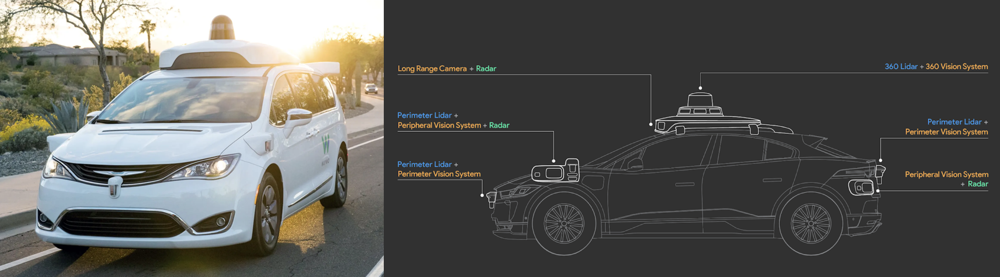
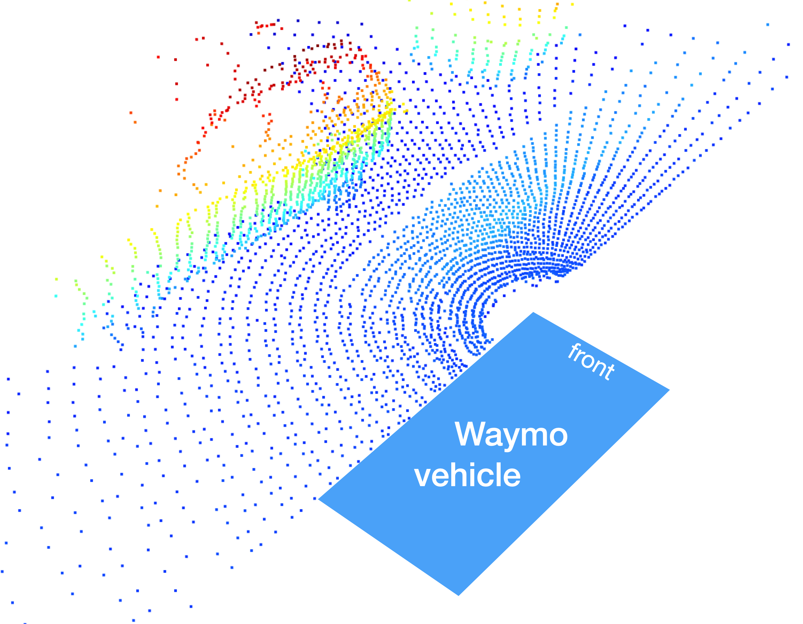
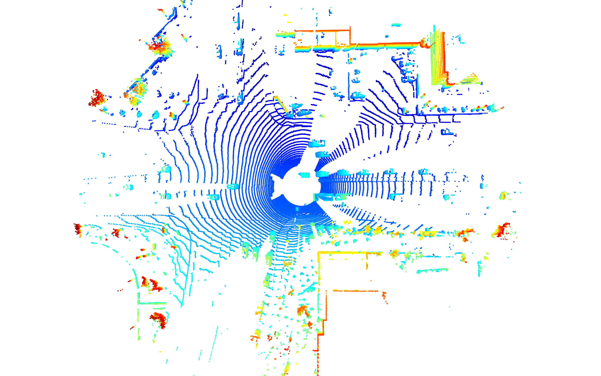
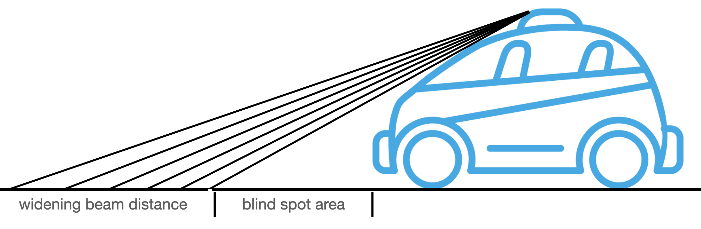

# LiDAR sensor

## LiDAR data in the Waymo dataset

[source](https://waymo.com)

The LiDAR sensors can be categorized into two broad groups:
-  **Perimeter LiDAR:** This sensor has a vertical field of vision ranging from -90° to + 30° with a range limited to 0-20m. The range limit is imposed on the data by Waymo and is only present in the Waymo Open Dataset. It can be assumed that the actual sensor range is significantly higher. Perimeter LiDARs are located on the front and back of the Waymo driverless vehicle as well as on the left / right front corners. Interestingly, the perimeter LiDAR is sold to companies not in direct competition with Waymo under the brand name Laser Bear Honeycomb (opens in a new tab). The following image shows the 3d point-cloud generated by the front-left LiDAR sensor:
    

- **360 LiDAR:** The top LiDAR has a vertical field of vision ranging from -17.6° to +2.4° with a range limited to 75m in the dataset. This LiDAR rotates around its vertical axis and produces a high-resolution 3d image over the 360° circumference of the vehicle. In the course, we will work with data from this sensor type to detect vehicles. The following image shows a 3d point-cloud generated by this LiDAR sensor in birds-view perspective:
    

- Two aspects are noteworthy here: (1) the distance between adjacent scanner lines increases with growing distance and (b) the area in the direct circumference of the vehicle does not contain any 3d points. Both observations can be easily explained by a look at the geometry of the sensor-vehicle setup:

### The structure of frames in the Waymo dataset
- The Waymo dataset stores information in .tfrecord files. All sequences contain approx. 200 individual frames, which have the following top-level structure: 
    - LaserName
    - CameraName
    - RollingShutterReadOutDirection
    - Frame
    - Label
- While the actual sensor data is stored in the Frame structure, we can use LaserName and CameraName to select specific sensors, which we want to access. For each laser and camera, there is a sub-branch nested under Frame.

#### Waymo open dataset tutorial
[Waymo Frame Structure Details](https://github.com/Jossome/Waymo-open-dataset-document)
[colab notebook](https://colab.research.google.com/github/waymo-research/waymo-open-dataset/blob/master/tutorial/tutorial.ipynb#scrollTo=-pVhOfzLx9us)

[Scalability in Perception for Autonomous Driving: Waymo Open Dataset](https://arxiv.org/pdf/1912.04838)

