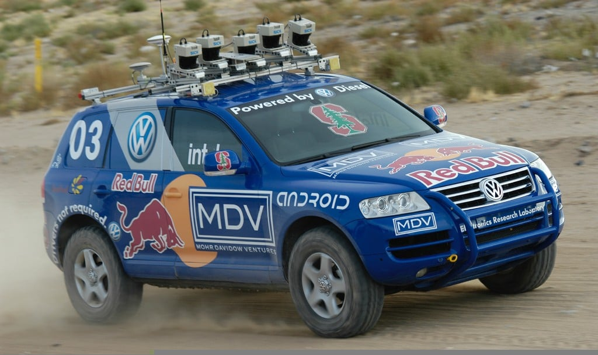
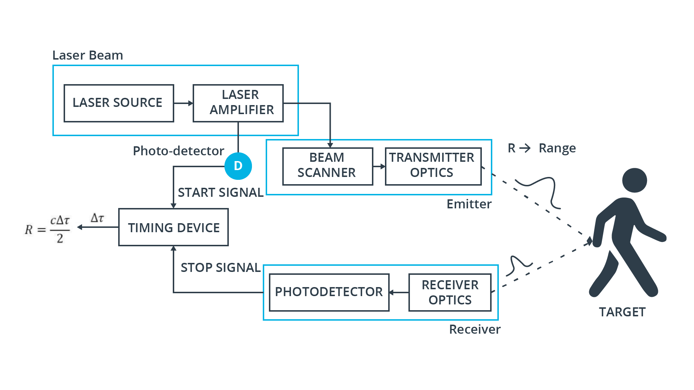
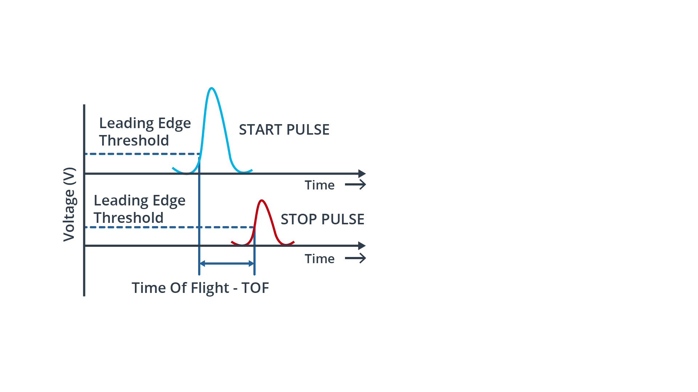
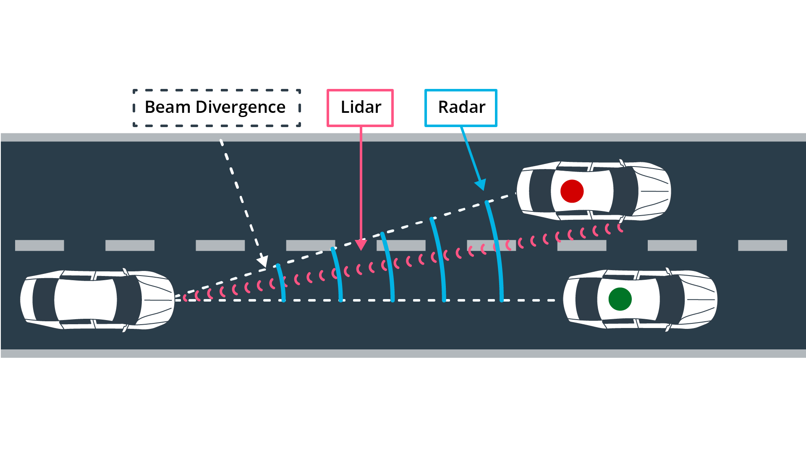
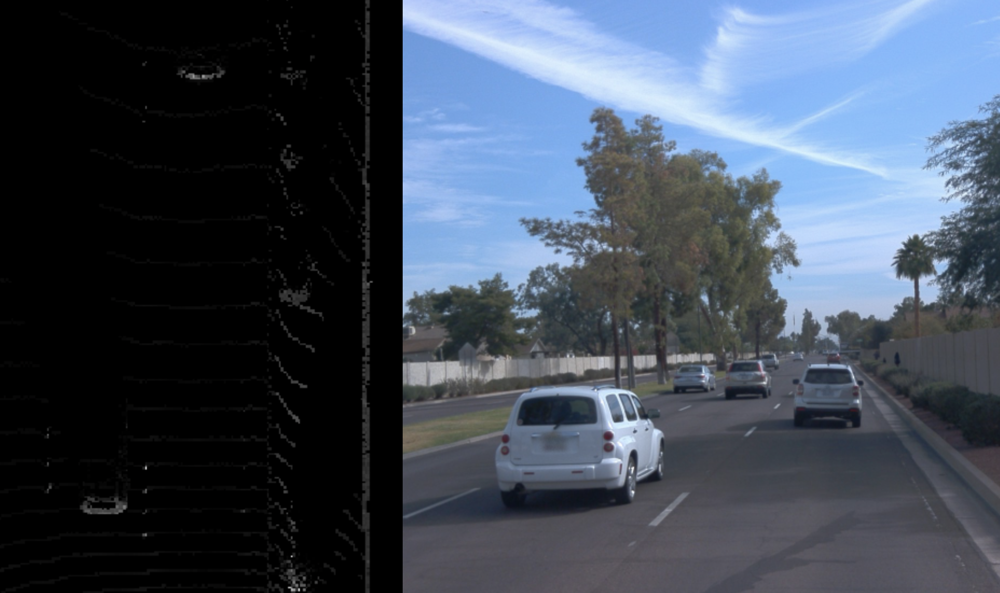
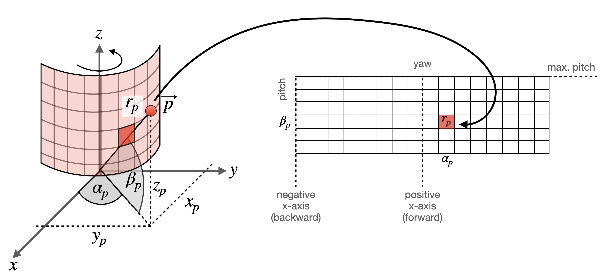

# LiDAR sensor

## Lidar Technical Properties

### A brief history of LiDAR
- LiDAR technology has been around for quite a while. The basic idea has been originally conceived in the 1930s by Irish physicist Edward H. Synge. Over the following decades, some first applications emerged, such as the Lunar Ranging Experiment on board Apollo 11 in 1969 or the creation of the first digital elevation model of archaeological sites in 2000. In 2005, the Stanford Racing Team won the DARPA Grand Challenge(opens in a new tab), a race between autonomous vehicles in the Mojave desert, using an array of SICK line scanners.

- Two years later, in 2007, the Stanford team was first to finish the DARPA Urban Challenge(opens in a new tab), a race within a mock-up city on George Air Force Base in the West United States, using a rotating 360° Velodyne LiDAR sensor as one of its primary sensing devices.

- Since then, with the advent of autonomous driving, significant improvements of LiDAR technology have been developed, making it one of the cornerstones of the autonomous vehicle sensor suite. But before we look at further details, let us revisit the basic working principle of LiDAR.

### The LiDAR working principle
The most common LiDAR sensor used today is called a "pulsed LiDAR". It is a system consisting of a laser source and a receiver with the source emitting short bursts of tight laser beams into a scene. When a beam hits an object, a fraction of the laser light is refracted back to the LiDAR sensor and can be detected by the receiver. Based on the time of flight of the laser light, the range R to the target can be computed using the equation: $$ R = \frac{c \cdot \Delta t}{2n} $$
where c is the speed of light in vacuum and 
n is the index of refraction of the propagation medium (for air,  n can be assumed as 1.0).

In the schematic, you can see the major parts "laser source", "emitter", "receiver" and "timer". First, a very short pulse in the order of a few picoseconds or nanoseconds is generated by the laser source. The laser pulse is then amplified by the amplifier and then directed into the atmosphere with the help of a beam scanner and transmitter optics. Each pulse is directed to a specific location within the sensors field of view as it scans over the region of interest. A portion of the backscattered pulse energy that reaches the receiver lens is collected through the receiver optics, then amplified and converted to a voltage signal.

In order to accurately measure the time between beam emission and detection, a very precise clock is needed. As can be seen from the following figure, a leading edge thresholding technique is used on the voltage signal to detect the moment in time, when the laser pulse returns.

The attainable range resolution is directly proportional to the resolution of the timing device. A typical resolution value of the time interval measurement can be assumed to be in the 0.1 ns range, which results in a range resolution of 1.5 cm.

The maximum range at which a target can be detected is mainly determined by the energy losses of the laser beam during its travel through the atmosphere. The lower the return energy and the higher the ambient noise, the harder it is for the receiver to detect a clear flank. The ratio between signal energy and background noise is described by the signal-to-noise-ratio (SNR), which is shown for several signals returned from targets at varying distances.

It can also be seen from the figure, that the signal peaks flatten out in proportion to the target distance, which is caused by a lack of beam coherence. This effect is referred to as "beam divergence" and it is directly proportional to the wavelength λ of the laser light. For a LiDAR with λ=1550nm for example, the smallest resolvable feature size in lateral direction due to beam divergence is ≈4cm at a distance of 100m. Just for comparison, a 77GHz radar sensor with a wavelength of λ=0.3cm, the smallest resolvable feature size at the same distance is 2m.

Also, as can be seen from the figure, the signal peak SNR decreases with increasing distances, which is caused by particles (such as water or dust) in the atmosphere that obstruct the laser path. An in-depth analysis of the performance degradation of LiDAR under the influence of fog and rain can be found in this paper(opens in a new tab).

There are two basic solutions for improving the SNR, which are (a) to increase the laser energy and (b) to increase the sensitivity of the receiver to detect weak signals in the presence of noise. While (a) is limited by the regulations on eye-safety, the approach (b) adds on significant complexity to the receiver electronics.

Another factor to be considered concerning maximum range is signal ambiguity, which states that at each point in time, there should be only a single laser pulse "in flight" so that the received pulse can be unambiguously associated with the previously emitted pulse.

Despite of the discussed limitations, time-of-flight pulsed LiDAR systems are the most frequently selected type (at present) for use in autonomous vehicles, mainly due to their simplicity and their capability to perform well outdoors, even under challenging environmental conditions.

Other time-of-flight methods are radar and ultrasound. Of these three ToF techniques, LiDAR provides the highest angular resolution, because of its significantly smaller beam divergence. It thus allows a better separation of adjacent objects in a scene, as illustrated in the following figure:

With currently available LiDAR systems however, the maximum range at which objects can be detected is still inferior to radar, which limits the speed at which LiDAR can be used as a primary sensing device (e.g. in highway scenarios).

### LiDAR selection criteria
- Eye Safety : As LiDAR sensors shoot laser beams into the atmosphere, it must be ensured that they are not harmful to the naked eye. As you have seen in the previous section, there are three factors which influence eye safety, which are (a) emitter power, (b) pulse duration and (c) light frequency. Eye safety standards categorize LiDAR sensors based on their output optical power level. For automotive applications, LiDAR sensors must either be classified as a Class 1 or Class 1M laser safety level.
- Field of View (FOV) : Autonomous vehicles must perceive their environment in a 360° circumference. Also, it must be ensured that the entire driving corridor with respect to the vehicle's height is observed. Both of these observations result in two parameters, which are the horizontal field-of-view (HFOV) and the vertical field-of-view (VFOV) of a sensor. If we consider the classic Velodyne HDL 64E LiDAR, the HFOV is at 360° and the HFOV is at 26.9°, which, from a roof-mounted position, is sufficient to scan the environment from close to far range. Instead of using a single sensor though, multiple sensors with overlapping FOV may be used to complement each other. In Waymo vehicles, for example, the three LiDAR sensors at the front with a comparatively narrow but overlapping HFOV are used to observe the front and side of the vehicle at close-range.
- Angular resolution : A critical parameter which controls the density of the point-cloud is the angular resolution of a LiDAR sensor. It defines the number of laser beams the sensor can project into its FOV. For the Velodyne HDL 64E with its 64 individual beams, the vertical resolution is at ≈0.4° while the horizontal resolution is at ≈0.8° based on the number of scans over a full rotation of the mirror. In order to track features such as curb-sides or a bicycle frame, a very fine angular resolution both in the horizontal and vertical direction are needed.
- Number of points : Based on the angular resolution and the field-of-view, the number of 3d points can be calculated which the sensor returns over a full scanning cycle.
- Frame rate : The frame rate of a LiDAR sensor provides the number of full sweeps over both the HFOV and the VFOF. In case of the Velodyne HDL 64E, the frame rate can be adjusted between 5Hz and 20Hz, depending on the requirements of the application and on the number of points that the respective system can handle performance-wise. Other than with the frame rate of a camera though, LiDAR measurements might not be performed at the same time instant. As the sensor sweeps across the scene, moving objects change their position, which results in smeared and potentially elongated objects, which have to be corrected before processing them. For solid-state LiDAR sensors however, this is not the case.
- Maximum range : Depending on the relative speed between LiDAR sensor and targets, you need to decide on the maximum range at which objects can still be detected with a sufficiently high probability. In LiDAR data sheets, you will find information on the maximum range of the respective sensor. However, you can not expect that the type of target you are looking for will actually be detected in a stable manner at maximum range. The reason for this can be explained by the way target measurements are performed by the LiDAR manufacturer: When assessing the range scanning capabilities of a sensor, a set of known targets with specific reflectance parameters will be used. Typically, a reflector is characterized as "poor", when its reflectance is below 10% and as "good", when reflectance exceeds 90%. In most cases, the target reflectance which has been used to define the maximum range will be specified in the data sheet.
- Range resolution : Based on factors such as return signal strength, receiver sensitivity and the resolution of the timing device, the range resolution provides the smallest change in target distance, that is still perceivable by the LiDAR system.

- Other common parameters are e.g. "Pulse Repetition Rate (PRR) or Frequency (PRF)", the "Peak Power" and "Average Power" as well as the "Wavelength" of the laser beam.

### Range images
- What are range images : Let us start this section with a quick comparison between point clouds and range images. Typically, the sensor data provided by a lidar scanner is represented as a 3d point cloud, where each point corresponds to the measurement of a single lidar beam. Each point is described by a coordinate in (x, y, z) and additional attributes such as the intensity of the reflected laser pulse or even a secondary return caused by partial reflection at object boundaries. In the following figure, a point cloud is shown where the brightness of a 3d point encodes the intensity of the laser reflection.

As can be seen, the rear sections of the preceding vehicles and the wall on the right side are clearly visible with high intensity values in the birds-eye-view on the left, whereas the road surface or even the side of the vehicle in the center lane do hardly register at all.

An alternative form of representing lidar scans are range images. This data structure holds 3d points as a 360 degree "photo" of the scanning environment with the row dimension denoting the elevation angle of the laser beam and the column dimension denoting the azimuth angle. With each incremental rotation around the z-axis, the lidar sensor returns a number of range and intensity measurements, which are then stored in the corresponding cells of the range image.

In the figure below, a point p in space is mapped into a range image cell, which is indicated by the corresponding azimuth angle 
α and the inclination β of the sensor. In the literature, α is often referred to as "yaw" whereas β is called "pitch".

In this example, only the range (i.e. the target distance) of p
is stored in the cell. However, in the Waymo dataset, the range image structure stores range, intensity, elongation and the vehicle pose at the time the measurement was created.

The elongation of the laser pulse beyond its nominal width in conjunction with the intensity can be useful for classifying atmospherical conditions such as rain, fog or dust. Experiments conducted by Waymo suggest that a signal with high elongation and low intensity suggests the presence of atmospherical hazards.