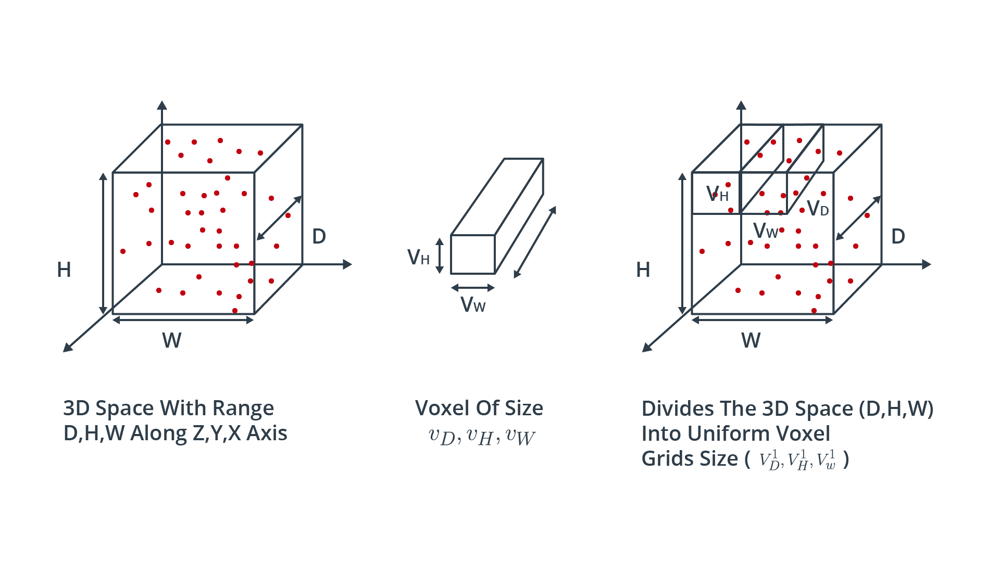
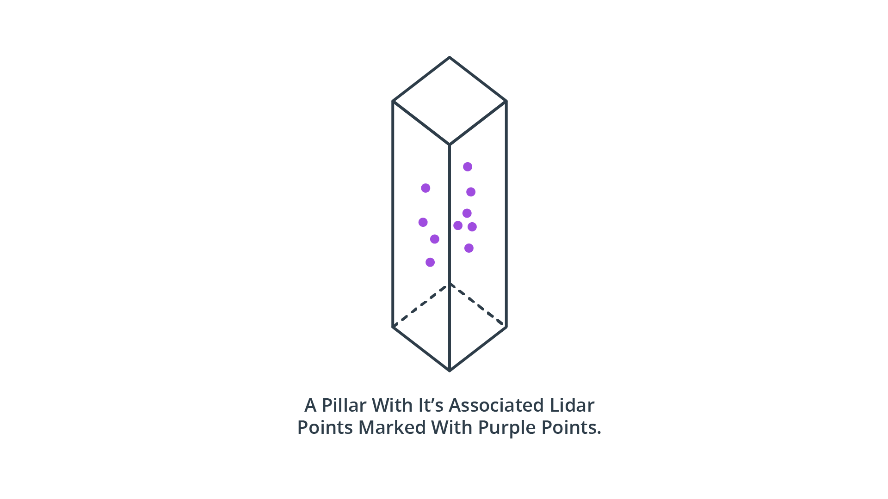
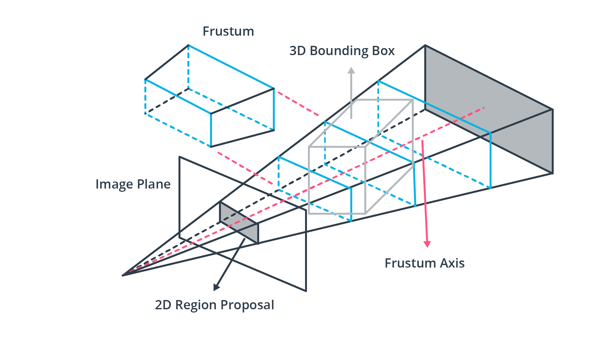
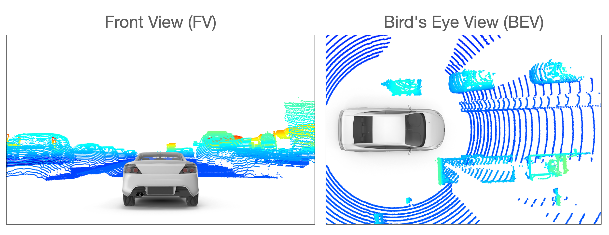
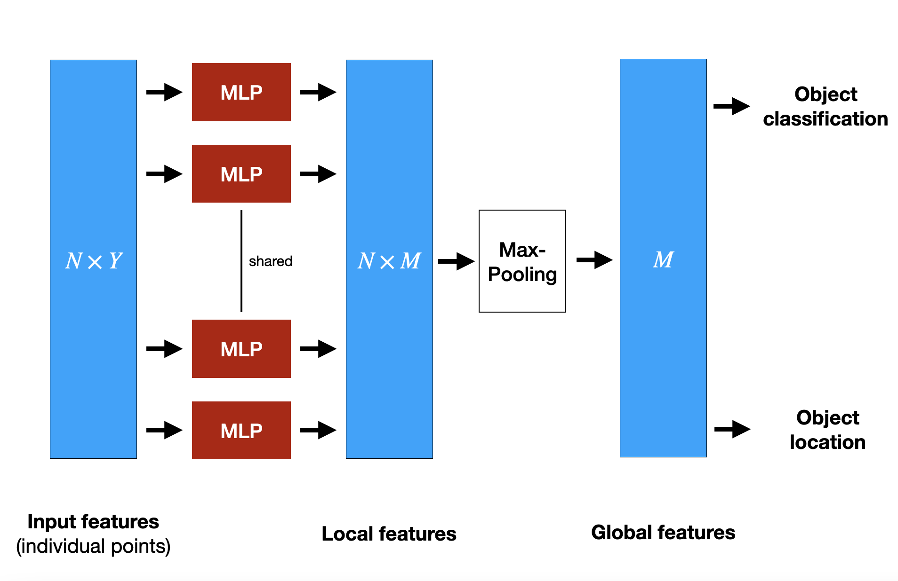
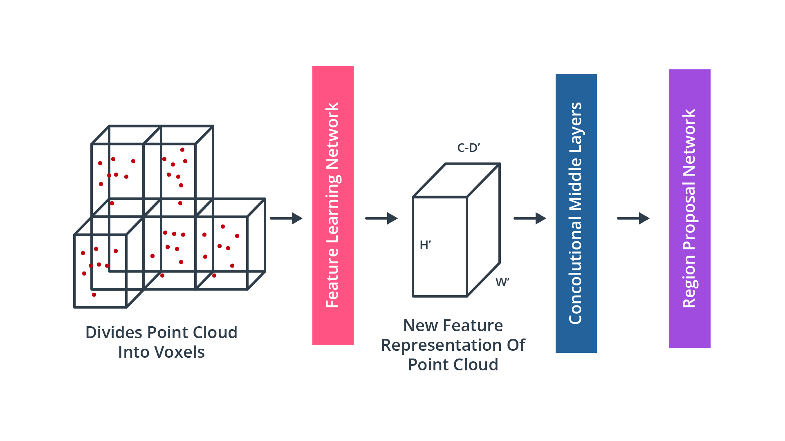

# 3D object detection on point clouds

- In recent years, deep learning based on 3D point-clouds has been attracting the attention of both academic communities and the automotive industry. Especially in the last four or five years, the number of published methods to address problems related to point-cloud processing has increased significantly.
- Compared to images, deep learning based on point clouds has been facing several challenges, such as the following:
    1. Point clouds are of a sparse and unstructured nature as the location of points in a scene and therefore both their density and number varies with the presence of objects in a scene. An image taken by a camera on the other hand always has the same number of pixels which can be fed to a neural network.
    2. As autonomous vehicles need to react very quickly, object detection must be performed in real-time. This means that a detection network must provide results within the time interval in between two scans.

## State-of-the-Art in 3D object detection
The pipeline structure for 3D object detection consists of three major parts, which are (1) data representation, (2) feature extraction and (3) model-based detection.

### 1. Data representation
Lidar point clouds are an unstructured assortment of data points which are distributed unevenly over the measurement range. With the prevalence of convolutional neural networks (CNN) in object detection, point cloud representations are required to have a structure that suits the need of the CNN, so that convolution operations can be efficiently applied.

- **point-based data representation** 
    
    Point-based methods take the raw and unfiltered input point cloud and transform it into a sparse representation, which essentially corresponds to a clustering operation, where points are assigned to the same cluster based on some criterion (e.g. spatial distance). In the next step, such methods extract a feature vector for each point by considering the neighboring clusters. Such approaches usually first look for low-dimensional local features for each single point and then aggregate them to larger and more complex high-dimensional features. One of the most prominent representatives of this class of approaches is PointNet(opens in a new tab) by Qi et al., which has in turn inspired many other significant contributions such as PointNet++(opens in a new tab) or LaserNet(opens in a new tab). One of the major advantages of point-based methods is that they leave the structure of the point cloud intact so that no information is lost, e.g. due to clustering. However, one of the downsides of point-based approaches is their relatively high need for memory resources as a large number of points has to be transported through the processing pipeline.

- **Voxel-based data representation**

    A voxel is defined as a volume element in a three-dimensional grid in space. A voxel-based approach assigns each point from the input point cloud to a specific volume element. Depending on the coarseness of the voxel grid, multiple points may land within the same volume element. Then, in the next step, local features are extracted from the group of points within each voxel. One of the most significant advantages of voxel-based methods is that they save memory resources as they reduce the number of elements that have to be held in memory simultaneously. Therefore, the feature extraction network will be computationally more efficient, because features are extracted for a group of voxels instead of extracting them for each point individually. A well-known representative of this class of algorithms is VoxelNet(opens in a new tab). The following figure shows a point cloud whose individual points are clustered based on their spatial proximity and assigned to voxels. After the operation is complete, the amount of data representing the object has significantly decreased.

    

- **pillar-based data representation**

    An approach very similar to voxel-based representation is the pillar-based approach. Here, the point cloud is clustered not into cubic volume elements but instead into vertical columns rising up from the ground up. As with the voxel-based approach, segmenting the point cloud into discrete volume elements saves memory resources - even more so with pillars as there are usually significantly fewer pillars than voxels. A well-known detection algorithm from this class is PointPillars(opens in a new tab).

    

- **Frustum-based data representation** 

    When combined with another sensor such as a camera, lidar point clouds can be clustered based on pre-detected 2d objects, such as vehicles or pedestrians. If the 2d region around the projection of an object on the image plane is known, a frustum can be projected into 3D space using both the internal and the external calibration of the camera. One method belonging to this class is e.g. Frustum PointNets(opens in a new tab). The following figure illustrates the principle. One obvious disadvantage of this method when compared to the previous ones is that it requires a second sensor such as a camera. However, as these are already used for object detection in autonomous driving and guaranteed to be on-board a vehicle, this is not a significant downside.
    
    

- **Projection-based data representation** 

    While both voxel- and pillar-based algorithms cluster the point-cloud based on a spatial proximity measure, projection-based approaches reduce the dimensionality of the 3D point cloud along a specified dimension. In the literature, three major approaches can be identified, which are front view (FV), range view (RV) and bird's eye view (BEV). In the FV approaches, the point cloud is compacted along the forward-facing axis while with BEV images, points are projected onto the ground plane. The following figure illustrates both methods. 

    

    RV methods are very similar to the FV approach with the exception that the point cloud is not projected onto a plane but onto a panoramic view instead. As you will recall from the previous lesson, this concept is the one implemented in the Waymo dataset, in which lidar data is stored as range images. In the literature, BEV is the projection scheme most widely used. The reasons for this are three-fold: (1) The objects of interest are located on the same plane as the sensor-equipped vehicle with only little variance. Also, (2) the BEV projection preserves the physical size and the proximity relations between objects, separating them more clearly than with both the FV and the RV projection.

### 2. Feature extraction
After the point cloud has been transformed into a suitable representation (such as a BEV projection), the next step is to identify suitable features. Currently, feature extraction is one of the most active research areas and significant progress has been made there in the last years, especially in improving the efficiency of the object detector models. The type of features that are most commonly used are (1) local, (2) global and (3) contextual features:

1. Local features, which are often referred to as low-level features are usually obtained in a very early processing stage and contain precise information e.g. about the localization of individual elements of the data representation structure.
2. Global features, which are also called high-level-features, often encode the geometric structure of an element within the data representation structure in relation to its neighbors.
3. Contextual features are extracted during the last stage of the processing pipeline. These features aim at being accurately located and having rich semantic information such as object class, bounding box shape and size and the orientation of the object.
- **Point-wise feature extractors**

    The term "point-wise" refers to the fact that the entire point cloud is used as input. This approach is obviously suited for the point-based data representation from the first step. Point-wise feature extractors analyze and label each point individually, such as in PointNet(opens in a new tab) and PointNet++(opens in a new tab), which currently are among the most well-known feature extractors. To illustrate the principle, let us briefly look at the PointNet architecture, which is illustrated in the following figure:

    
    PointNet uses the the entire point cloud as input. It extracts global structures from spatial features of each point within a subset of points in Euclidean space. To achieve this, PointNet implements a non-hierarchical neural network that consists of the three main blocks, which are a max-pooling layer, a structure for combining local and global information and two networks that align the input points with the extracted point features. In the diagram, N refers to the number of points that are fed into PointNet and Y is the dimensionality of the features. In order to extract features point-wise, a set of multi-layer perceptrons (MLP) is used to map each of the N points from three dimensions (x,y,z) to 64 dimensions. This procedure is then repeated to map the N points from 64 dimensions to M=1024 dimensions. When this is done, max-pooling is used to create a global feature vector in R^1024. Finally, a three-layer fully-connected network izs used to map the global feature vector to generate both object classification and object location. One of the downsides of PointNet is its inability to capture local structure information between neighboring points, since features are learned individually for each point and the relation between points is ignored. This has been improved e.g. in PointNet++, but for reasons of brevity we will not go into further details here. Even though point-wise feature extractors show very promising results, they are not yet suitable for use in autonomous driving due to high memory requirements and computational complexity.

- **Segment-wise feature extractors**

    Due to the high computational complexity of point-based features, alternative approaches are needed so that object detection in lidar point clouds can be used in a real-time environment. The term "segment-wise" refers to the way how the point cloud is divided into spatial clusters (e.g. voxels, pillars or frustums). Once this has been done, a classification model is applied to each point of a segment to extract suitable volumetric features. One of the most-cited representatives of this class of feature extractors is VoxelNet(opens in a new tab). In a nutshell, the idea of VoxelNet is to encode each voxel via an architecture called "Voxel Feature Extractor (VFE)" and then combine local voxel features using 3D convolutional layers and then transform the point cloud into a high dimensional volumetric representation. Finally, a region proposal network processes the volumetric representation and outputs the actual detection results.

    

### 3. Detection and prediction
Once features have been extracted from the input data, a detection network is needed to generate contextual features (e.g. object class, bounding box) and finally output the model predictions. Depending on the architecture, the detection process can either perform a single-pass or a dual-pass. Based on the detector network architecture, the available types can be broadly organized into two classes, which are dual-stage encoders such as R-CNN(opens in a new tab), Faster R-CNN(opens in a new tab) or PointRCNN(opens in a new tab) or single-stage encoders such as YOLO(opens in a new tab) or SSD(opens in a new tab). In general, single-stage encoders are faster than dual-stage encoders, which makes them more suited for real-time applications such as autonomous driving.

A problem faced by CNN-based object detection is that we do not know how many instances of a certain object type are located within the input data. It could be that only a single vehicle is visible in the point cloud, or it could also be 10 vehicles. A naive approach to solve this problem would be to apply a CNN to multiple regions and check for the presence of objects within each region individually. However, as objects will have different locations and shapes, one would have to select a very large number of regions, which quickly becomes computationally infeasible.

To solve this problem, Ross Girshick et al. proposed a method (R-CNN) where a selective search is used to extract ~2000 regions, which he called region proposals. This meant a significant decrease in the number of regions that needed to be classified. Note that in the original publication, the input data were camera images and not point clouds. The candidate regions are then fed into a CNN to produce a high-dimensional feature vector, from which the presence of objects within the candidate regions is inferred using a support vector machine (SVM). 

In order to refine the predictions and increase the accuracy of the model output, dual-stage encoders feed the results from the first stage to an additional detection network which refines the predictions by combining different feature types to produce refinement results.

Single-stage object detectors on the other hand perform region proposal, classification and bounding box regression all in one step, which makes them significantly faster and thus more suitable for real-time applications. In many cases though, two-stage detectors tend to achieve better accuracy.

One of the most famous single-stage detectors is YOLO (You Only Look Once). This model runs a deep learning CNN on the input data to produce network predictions. The object detector decodes the predictions and generates bounding boxes, YOLO uses anchor boxes to detect classes of objects, which are predefined bounding boxes of a specific height and width. These boxes are defined to capture the scale and aspect ratio of specific object classes (e.g. vehicles, pedestrians) and are typically chosen based on object sizes in the training dataset. During detection, the predefined anchor boxes are tiled across the image. The network predicts the probability and other attributes, such as background, intersection over union (IoU) and offsets for every tiled anchor box. The predictions are used to refine each individual anchor box.

When using anchor boxes, you can evaluate all object predictions at once without the need for a sliding-window as with many classical applications. An object detector that uses anchor boxes can process the entire input data at once, making real-time object detection systems possible.

The network returns a unique set of predictions for every anchor box defined. The final feature map represents object detections for each class. The use of anchor boxes enables a network to detect multiple objects, objects of different scales, and overlapping objects.